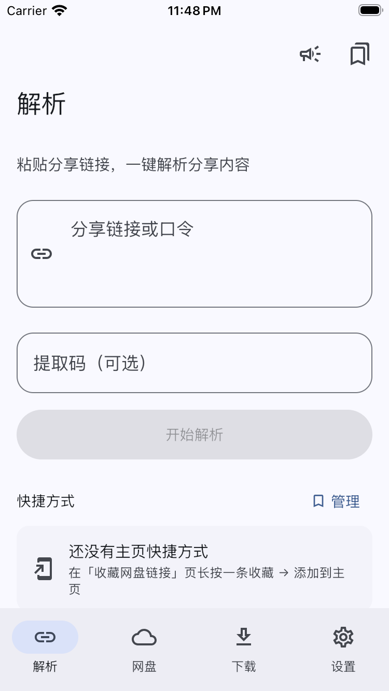
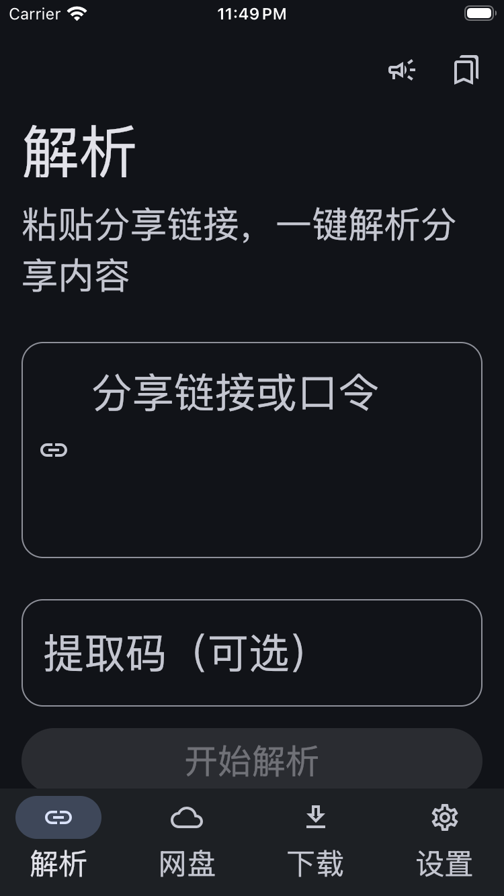

# iOS UI 适配与验证 · 2026-10-10

应用代码提交：`e43171992a30c2bf09844b5cd6aed5da40f003a8`，版本 **0.1.1 (5)**。分支 `codex/ui-adaptation` 与 main 已同步。

使用 iOS 系统字体，调整正文、标题、标签的字号与行高，取消额外字距。Compose 1.8.2 的 UIKit density 将系统 preferredContentSizeCategory 映射到 fontScale；SwiftUI 宿主观察 sizeCategory 并更新子视图布局，使运行中修改 Dynamic Type 也触发内建字号更新。辅助字号映射最大为 1.8，并非 UIKit 各文本样式的非线性曲线。

首次启动直接进入解析页，旧 onboarding 偏好不影响启动路径。关于页读取原生实际版本与构建号。设置页“获取最新 iOS 版本”打开 Cloudflare 分发页；启动时不会将 Android 上游发布版本与 iOS 版本比较并弹出更新说明。

共用 AppScaffold 应用并消费安全区，为键盘留出空间，内容宽度上限 840dp。主导航按可用宽度和高度使用底栏、侧栏或紧凑顶栏；键盘打开时隐藏底栏。页面与弹层可滚动，按钮可换行，支持 iPhone 横屏。设置页将平台线程设置折叠，下载目录说明使用“文件”App 路径，原生启用 Documents 文件共享。后台下载说明区分普通直链与登录网盘、视频分片任务。

## 实际验证

Windows 本地和 GitHub Actions macOS runner 执行 `:shared:jvmTest` 均为 **8 项通过，0 失败**（3 项业务回归、5 项 UI 检查）。本轮 macOS 生成 **79 张 Compose PNG**，截图与 XML/HTML 报告位于 [共享测试运行](https://github.com/cc1477/YunX-iOS/actions/runs/38005200244/artifacts/11650399591) 的 YunX-ui-validation 附件，保留 7 天。

覆盖旧引导偏好 true/false 的同一默认启动路径、安全区只应用一次、平板内容宽度、登录与说明页、四个主 Tab、弹层和动画时长缩放 0，以及 320×568 窄屏、375×667 大字号、667×375 横屏、深浅色。离屏 Compose 测试的渲染与动画协程在同一 Swing UI 线程执行，避免 SharedTransitionScope 清理与渲染并发造成的随机空引用。

同一运行完成 Xcode iOS 模拟器编译、安装和启动检查，应用启动 15 秒后仍运行。已查看 4 张原生首页截图：标准字号、运行中切换最大辅助字号、最大辅助字号冷启动、最大辅助字号深色。运行中切换与冷启动的大字号图像一致。完整截图与模拟器 App 位于 [YunX-simulator 附件](https://github.com/cc1477/YunX-iOS/actions/runs/38005200244/artifacts/11651720859)，保留 7 天。

标准字号与大字号深色截图同时保存在仓库，便于长期查看：

| 标准字号 | 系统大字号 · 深色 |
| --- | --- |
|  |  |

[真机打包运行](https://github.com/cc1477/YunX-iOS/actions/runs/38005200233) 已编译并验证 arm64 App、共享框架与未签名 IPA，GitHub Pages 部署成功。IPA 不含 provisioning profile，需使用自己的签名工具签名安装。

真机签名安装、登录、下载、VoiceOver、WKWebView 键盘交互，以及 iPad 分屏尚未验证。共享布局渲染和模拟器启动检查不能代替这些原生交互验证。

## 分发

- [Cloudflare LCSign 分发页](https://yunx-lcsign-cc1477.pages.dev/)
- [GitHub Pages 备用](https://cc1477.github.io/YunX-iOS/)
- IPA：28236250 bytes
- SHA-256：`d8eedaf0b1ccfd05a1a6ed4afc549b4366218fd2ba17707850bce223d93baabd`
- 源提交：`e43171992a30c2bf09844b5cd6aed5da40f003a8`
- 构建时间：2026-10-09T23:53:25.084698+00:00
- [Cloudflare 发布运行](https://github.com/cc1477/gametool/actions/runs/38006715494)

IPA 保存在 Cloudflare R2，通过包含 SHA-256 的独立 URL 和 Pages 下载处理器分发。已从公开地址完整下载，核验包内版本、构建号、包名、大小及 SHA-256；Range 0–1023 返回 206 和 1,024 字节，并与完整文件相同区间一致。
